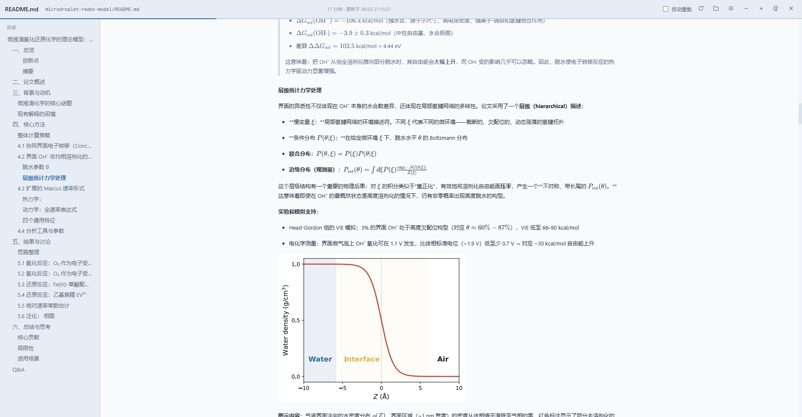
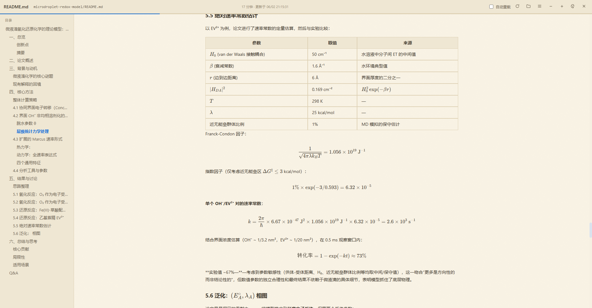

# `@s1lencewill/dsh-markdown-reader`

[简体中文](README.md) | [English](README_EN.md)

DSH Web GUI 的全屏 Markdown 阅读器插件：一个双面（host + client）的 profile bundle，
零构建、零运行时依赖，热插拔无需任何 dsh 源码改动。

## 功能

- **GFM 渲染**：ATX/Setext 标题、围栏与缩进代码块、引用、有序/无序/嵌套列表、
  任务列表、表格（含对齐）、分隔线、行内强调/删除线/代码/链接/图片/自动链接、换行
- **大纲目录 + 滚动定位**：自动提取标题生成目录（GitHub 风格 slug，重复去重），
  跟随滚动高亮，点击平滑跳转
- **KaTeX 数学公式**：`$…$`、`\(…\)` 行内与 `$$…$$`、`\[…\]` 块级；资源随包分发
  （`vendor/katex/`），完全离线，无 CDN 依赖
- **Mermaid 图表管线**：```mermaid 代码块按需加载渲染器（v11.16.1 随包分发，
  无控制台噪音），明暗主题跟随 Web GUI；文件缺失时优雅降级为带说明的源码块
- **相对路径图片**：`` 相对当前文档解析，经工作区门禁的
  `/md-reader/raw` 提供字节
- **文档内跳转**：`#锚点` 原生定位；相对 `.md` 链接直接在阅读器内切换文档
- **阅读体验**：字号调节（12–24px）、目录折叠、刷新、最近文件（按项目持久化）、
  阅读进度、预计阅读时间、加载/错误状态、Esc 关闭、焦点圈定
- **外部更新同步**：每 4 秒通过轻量元数据接口检查当前文件；编辑器或 agent 改写后
  提示载入新版，也可按项目启用自动重载，并保持当前阅读位置
- **长文档组件增强**：图片点击放大与下载；代码块复制、折叠和行号；宽表格横向滚动与
  粘性表头；长章节可就地折叠
- **打印 / PDF**：打印当前文档的独立副本，展开折叠内容、移除操作控件，使用白底分页排版；
  保留公式、图表和图片，通过浏览器打印窗口另存 PDF
- **四种主题**：暖纸（象牙底 + 噪点纸纹）/ 清冷（蓝灰）/ 护眼（豆沙绿）/ 素白（GitHub 风），
  头部调色盘按钮循环切换，全局持久化；每种主题自带明暗两套配色，跟随 GUI 主题标记

## 预览效果

### 清冷主题



### 暖纸主题



## 为什么采用独立看板

这个阅读器不是用来替代侧边栏，而是为长篇 Markdown 提供一个互补的专注阅读视图。
它不会修改、降级或恢复 `dsh-better-sidebar`；两者可以同时启用。

| 独立看板的优势 | 实际效果 |
|---|---|
| **完整阅读空间** | 使用整个窗口展示正文、宽表格、代码、公式和大图，不受侧边栏宽度限制 |
| **阅读状态独立** | 阅读器拥有自己的滚动位置、目录高亮、字号、主题与最近文件，不干扰侧边栏状态 |
| **适合复杂长文档** | 目录与正文可以并排显示，并支持长章节折叠、代码块工具和图片灯箱 |
| **减少界面挤压** | 阅读时无需持续扩大侧边栏，也不会压缩聊天区、编辑区或其它工作面板 |
| **低耦合、易维护** | 通过独立浮层和只读路由工作，不侵入侧边栏源码；可单独启用、更新或停用 |

侧边栏更适合文件导航、状态查看和快速操作；独立看板更适合连续阅读、审阅报告及展示
包含大量公式、表格、代码和图片的文档。

## 入口

| 入口 | 行为 |
|---|---|
| 右下角悬浮按钮 | 打开该项目最近的文件；无记录则打开路径选择器 |
| `Ctrl/Cmd + Shift + M` | 开关阅读器（同上） |
| 右侧预览面板工具栏「阅读模式」按钮 | 打开面板中最后点击的 `.md` 文件（监听面板 DOM，不改面板代码） |
| `window.dshMarkdownReader.open(path)` / CustomEvent `dsh-markdown-reader:open` | 供其它插件/脚本集成 |

打开后可在顶部路径框中输入任意工作区相对路径（Enter 打开），点击目录图标回到选择器。

## 打印与另存 PDF

1. 打开 Markdown 文档，点击顶部 **打印 / PDF**；阅读器打开时也可按 `Ctrl/Cmd + P`。
2. 等待图片、公式字体和正在渲染的图表准备完成，浏览器会打开打印窗口。
3. 选择打印机，或将目标设为 **另存为 PDF**，再选择保存位置。

打印只包含当前文档，不包含 DSH 聊天、侧边栏、阅读器工具栏和目录。打印副本中的章节
和代码块会全部展开；关闭或取消打印后，原来的折叠状态和阅读位置不变。代码长行自动换行，
表格允许跨页并重复表头，公式和图片按纸张内容宽度适配。深色 Mermaid 图表保留背景以维持对比度。

默认使用浏览器纸张设置和专用页边距，建议 A4 或 Letter；列数很多的表格可选择横向布局。
浏览器自动添加的页眉、页脚和页码可在打印窗口中调整。文件若被 4 MB 上限截断，打印稿会明确
注明仅包含已载入部分；失败图片显示占位说明，未完成的公式或图表保留源码。资源等待超时会提示
重试，不会悄悄输出缺失的内容。此功能不使用服务端 PDF 转换，也不会把文档上传到转换服务。

## 安装

标准方式（要求本机 PATH 有 pnpm）：

```sh
dsh plugin --profile web add link:G:/hanako/dsh_plu/dsh-markdown-reader
```

之后重启 `dsh web` 进程并刷新页面。`dsh plugin` 会按 `dsh.bundle.patch`
（`cordis.patch.yml`）自动把包加入 `dsh.profile.bundles` 清单。

无 pnpm 的手工方式：

1. 将本目录链接/复制到 profile 的 node_modules：
   `C:\Users\yxh\.dsh\profiles\web\node_modules\@s1lencewill\dsh-markdown-reader`
   （目录联接 `mklink /J` 可让后续源码改动即时生效）
2. 在 `C:\Users\yxh\.dsh\profiles\web\package.json` 中：
   - `dependencies` 加入 `"@s1lencewill/dsh-markdown-reader": "link:..."`（或任意占位）
   - `dsh.profile.bundles` 追加 `"@s1lencewill/dsh-markdown-reader"`
3. 重启 DSH，刷新页面。

## 架构

```
lib/index.js    宿主端（纯 Node ESM，无依赖）
  - POST /md-reader/read   读取工作区 .md/.markdown/.mdx（4MB 上限，截断标记）
  - POST /md-reader/stat   仅返回 mtime/size，供外部变更轮询（不读取正文）
  - GET  /md-reader/raw    提供图片等嵌入资源字节（100MB 上限，按扩展名给 MIME）
  - GET  /md-reader/assets/*   vendored 资源（KaTeX JS/CSS/字体、Mermaid drop-in）
  - GET  /aionui-panel/katex/* 与 /aionui-panel/hljs/*  兼容路由（更长前缀遮蔽
     aionui-panel 的资产子路由——皮肤切换触发的配置热重载会让面板宿主代码处于
     半新半旧的破损态并对资产路由返回 405，此处从本插件 vendor 提供同源资源）
  - systemPrompt.section    向 agent 公告插件能力（order 220）
lib/client.cjs  浏览器端（单文件 bundle，复刻 window.__ModuleLoader__.load 契约）
  - 渲染管线：数学占位保护 → GFM 块解析 → 行内渲染（分隔符栈强调算法）→
    DOMParser 白名单清洗 → 数学还原 → Mermaid 渲染
  - 全屏浮层 React UI（react 来自 shell 模块表，惰性 require）
  - 代际隔离 + 自愈看门狗：皮肤切换/热重载导致的重新 apply 或 DOM 摘除可自动恢复
vendor/katex/   KaTeX 资源（MIT，与 dsh-aionui-panel 同源）
vendor/hljs/    highlight.js 资源（MIT，兼容路由用）
vendor/mermaid/ Mermaid 渲染器（已随包分发，v11.16.1）
```

### 安全模型

与 `dsh-aionui-panel` 同一套工作区门禁：每个请求的 `root` 经 `realpath` 规范化并
要求属于已注册工作区；解析后的目标文件再次 `realpath` 并做前缀包含校验，`..` 与
符号链接逃逸均被拒绝。路由**只读**（无任何写操作）。POST 强制
`application/json` 内容类型阻断表单式 CSRF。渲染输出经白名单清洗，链接/图片
协议白名单（http/https/mailto/锚点/相对路径），`data:`、`javascript:` 一律丢弃。

### 客户端 bundle 契约

DSH 的 client-modules 会把 `exports["./client"]` 指向的文件原样提供到
`/plugins/@s1lencewill/dsh-markdown-reader/client.js`（路径与模块 ID 均来自 npm
包名；`cordis.patch.yml` 中的 `id` 仅用于 Cordis 配置）。文件必须自注册：

```js
window.__ModuleLoader__.load({ id: '<包名>', factory: (require) => api })
```

`factory` 的返回值即模块导出（`{inject, apply}`）。本仓库无构建步骤：源码即产物，
`lib/client.cjs` 同时充当 Node 测试入口（纯函数导出）。

## Mermaid

`vendor/mermaid/mermaid.min.js` 已随包分发（mermaid v11.16.1 官方构建，MIT）。
阅读器按需加载：客户端先探测资源存在（HEAD → GET 回退，无控制台 404 噪音），
存在才注入 `<script>`；渲染以 `securityLevel: 'strict'` 沙箱运行，主题自动跟随
`body[data-ds-dark-theme]`。文件缺失时图表优雅降级为带说明的源码块。
详见 `vendor/mermaid/README.txt`。

## 测试

```sh
npm test                       # 完整测试套件
node test/engine.test.mjs    # 纯引擎用例（渲染/数学保护/路径解析/清洗白名单/主题）
node test/katex-e2e.mjs      # 真实 KaTeX 端到端（vendored UMD）
node test/mermaid-e2e.mjs    # vendored mermaid 加载/API/解析验证
node test/reapply.test.mjs   # 皮肤切换/HMR 重新 apply 的健壮性（代际隔离）
node --test test/host.test.mjs      # 宿主路由、工作区门禁与安全响应头
node --test test/metadata.test.mjs  # 包名、bundle、客户端与文档一致性
node --test test/print.test.mjs     # 打印资源等待、取消与分页样式回归
npm run test:print                  # 可选：真实 Chromium 打印副本与 PDF 排版回归
```

`test:print` 需开发环境提供 Playwright（不属于插件运行时依赖），默认使用本机 Edge。
可用 `PRINT_BROWSER_CHANNEL` 或 `PRINT_BROWSER_EXECUTABLE` 指定浏览器，
`PRINT_TEST_OUTPUT` 指定测试 PDF 目录（默认 `tmp/pdfs/`）。测试拦截系统打印窗口，
再用相同的打印副本生成 PDF，验证浅色/深色图表、折叠内容、资源失败及取消后的清理。

## 已知边界

- 不支持引用式链接 `[x][ref]`、脚注（渲染为原文）
- 行内 HTML 仅白名单标签通过；`<script>` 等内容整体丢弃
- 强调算法为简化版 CommonMark（常见嵌套场景正确；病态分隔符组合可能退化）
- 顶层 4 空格缩进的 `- item` 会解析为列表而非缩进代码（阅读场景更合理）
- 未安装 Mermaid 时图表显示为带说明的源码块
